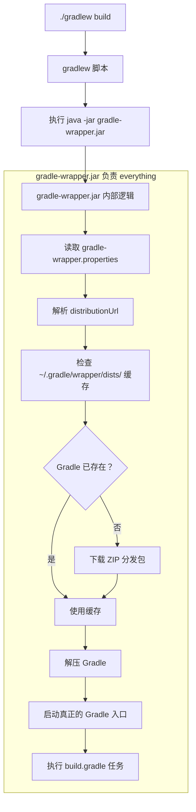
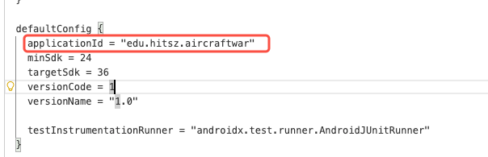
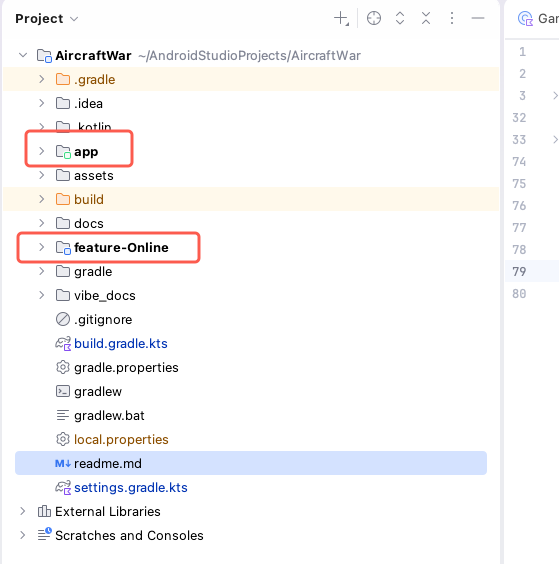

# Android项目学习收获——更深入的理解

## 一、gradle与gralew工具流程


了解原理后，便可以直接脱离Android Studio集成环境进行编译了
```shell
cd <project_root_dir>
./gradlew assembleDebug
```
这是构建一个debug类型的apk包，具体位置通常在**app/build/outputs/apk/debug/**下，更多的gradlew命令可以自行查找

<br>

## 二、安装apk到模拟器或真机

- 先使用adb查看设备
    ```shell
    adb devices
    ```
这里会显示所有运行的设备，包含真机和模拟器

### 安装应用到真机

如果有真机，那最方便了，直接安装apk包，即可调试了
- 安装应用
  ```shell
  adb -s <device_id> install <app.apk path>
  ```

- 在真机上运行应用后，通过logcat查看日志信息
  ```shell
  adb -s <device_id> shell
  ps -ef | grep <app_package_name>
  logcat --pid=<pid>
  ```
  通过这种方式得到的日志，和在Android Studio中得到的一致

  应用包名在app下的build.gradle下指出
    

### 安装到模拟器

模拟器可执行文件通常在Android SDK下，具体参考为<strong>~/Library/Android/sdk/emulator/emulator</strong>

- 查看可用模拟器
  ```shell
  emulator -list-avds
  ```

- 启动对应设备
  ```shell
  emulator -avd <模拟器名称>
  ```
  启动后会跳出对应图形界面，后续安装等操作同真机测试

## 三、在App，即启动模块导入自定义的依赖

### 创建自定义的依赖

即在当前工程目录下创建一个No activity的Module，取名feature-xxx或者group-xxx，如图


然后可以在settings.gradle中看到导入的模块
```vim
rootProject.name = "AircraftWar"
include(":app")
include(":feature-Online")
```

### 导入依赖

在对应模块/主app中的build.gradle中添加，如下
```vim
dependencies {
  implementation(libs.androidx.core.ktx)
  implementation(libs.androidx.appcompat)
  implementation(libs.material)
  implementation(libs.androidx.activity)
  implementation(libs.androidx.constraintlayout)
  implementation(project(":feature-Online")) # 导入自定义模块依赖
  implementation("com.google.code.gson:gson:2.13.2") # 导入第三方依赖
  testImplementation(libs.junit)
  androidTestImplementation(libs.androidx.junit)
  androidTestImplementation(libs.androidx.espresso.core)
}
```
