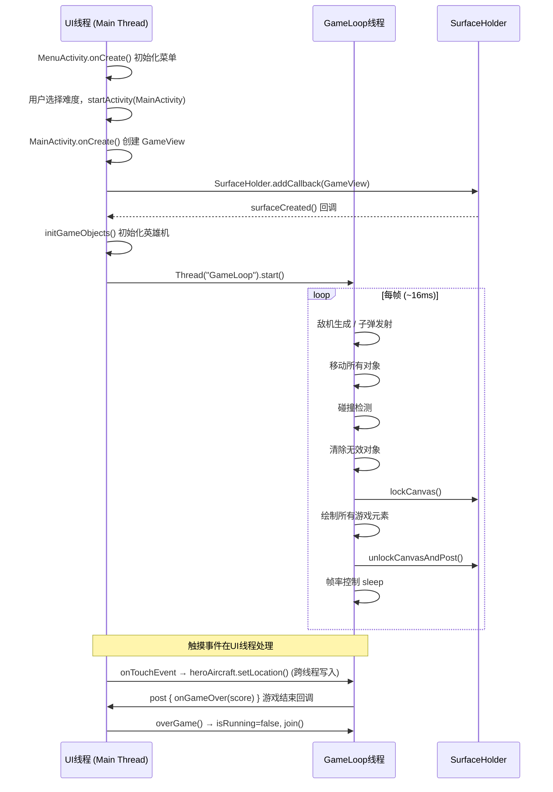
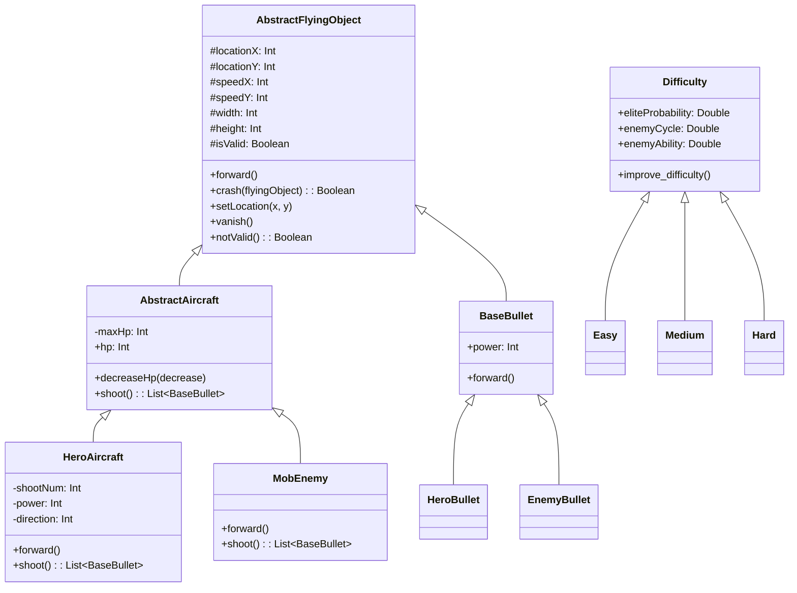

# AircraftWar 项目架构分析文档 v0.1

## 一、项目概述

本项目是一个基于 Android 平台的纵向卷轴飞机大战游戏，使用 **Kotlin** 语言开发，从 Java Swing 桌面版移植而来。游戏采用 `SurfaceView` 进行高性能 2D 渲染，通过独立的游戏循环线程驱动逻辑更新与画面绘制。

- **包名**: `edu.hitsz.aircraftwar`
- **最低 SDK**: 24 (Android 7.0)
- **目标 SDK**: 36
- **语言**: Kotlin
- **构建工具**: Gradle (Kotlin DSL)

---

## 二、项目目录结构

```
edu.hitsz.aircraftwar/
├── AircraftWarApplication.kt       # Application 入口，全局上下文与屏幕尺寸
├── MainActivity.kt                 # 游戏页面 Activity
├── Views/
│   ├── GameView.kt                 # 核心游戏视图（SurfaceView），包含游戏主循环
│   └── MenuActivity.kt             # 菜单页面 Activity（难度选择、音效开关）
├── logic/
│   ├── aircraft/
│   │   ├── AbstractAircraft.kt     # 飞机抽象基类（含 HP、射击接口）
│   │   ├── HeroAircraft.kt         # 英雄飞机（触屏控制，向上发射子弹）
│   │   └── MobEnemy.kt             # 普通敌机（向下移动，出界消失）
│   ├── basic/
│   │   └── AbstractFlyingObject.kt # 所有飞行物体的抽象基类（坐标、移动、碰撞检测）
│   ├── bullet/
│   │   ├── BaseBullet.kt           # 子弹抽象基类（含伤害值、出界判定）
│   │   ├── EnemyBullet.kt          # 敌方子弹
│   │   └── HeroBullet.kt           # 英雄子弹
│   ├── difficulty/
│   │   ├── Difficulty.kt           # 难度抽象基类（精英概率、敌机周期、能力倍率）
│   │   ├── Easy.kt                 # 简单难度（不提升难度）
│   │   ├── Medium.kt               # 中等难度（渐进提升）
│   │   └── Hard.kt                 # 困难难度（快速提升）
│   └── utils/
│       └── ImageManager.kt         # 图片资源管理器（单例，类名→Bitmap 映射）
└── setting/
    └── Setting.kt                  # 全局设置（难度、音效开关）
```

---

## 三、线程模型分析

### 3.1 线程总览

本项目运行时包含 **2 个主要线程**：

| 线程名称 | 类型 | 创建位置 | 职责 |
|---------|------|---------|------|
| **Main Thread (UI 线程)** | Android 主线程 | 系统自动创建 | Activity 生命周期管理、布局渲染、触摸事件分发 |
| **GameLoop** | 自定义子线程 | `GameView.startGame()` | 游戏逻辑更新 + SurfaceView 画面绘制 |

### 3.2 UI 线程（Main Thread）详细分析

UI 线程是 Android 系统自动创建的主线程，负责以下工作：

#### 3.2.1 Activity 生命周期管理

```
MenuActivity (LAUNCHER)
    ├── onCreate()  → setContentView(activity_menu.xml)
    │                → Setting.init() 初始化设置
    │                → 绑定按钮点击事件、音效开关
    └── 用户点击难度按钮 → startActivity(MainActivity)

MainActivity
    ├── onCreate()  → setContentView(activity_main.xml)
    │                → ImageManager.init() 加载图片资源
    │                → 创建 GameView 实例并添加到 FrameLayout 容器
    │                → 设置 onGameOver 回调
    ├── onResume()  → gameView.startGame() 启动游戏循环线程
    ├── onPause()   → gameView.overGame() 停止游戏循环线程
    └── onDestroy() → gameView.release() 释放资源
```

#### 3.2.2 触摸事件处理

触摸事件由 UI 线程分发到 `GameView.onTouchEvent()`：

- `ACTION_DOWN` / `ACTION_MOVE` → 直接更新 `heroAircraft` 的坐标位置
- 英雄飞机跟随手指移动，实现触屏操控

> ⚠️ **线程安全隐患**：触摸事件在 UI 线程中修改 `heroAircraft` 的坐标，而 GameLoop 线程同时读取该坐标进行碰撞检测和绘制，存在潜在的竞态条件（当前未加同步锁）。

#### 3.2.3 游戏结束回调

当 GameLoop 线程检测到英雄机 HP ≤ 0 时，通过 `post { onGameOver?.invoke(score) }` 将回调切换回 UI 线程执行。

### 3.3 GameLoop 线程详细分析

GameLoop 是项目中唯一的自定义子线程，在 `GameView.startGame()` 中创建：

```kotlin
gameThread = Thread(this, "GameLoop").apply { start() }
```

#### 3.3.1 游戏主循环流程

```
┌─────────────────────────────────────────┐
│            GameLoop 线程                 │
│                                         │
│  while (isRunning && !gameOverFlag) {   │
│    ┌─────────────────────────────────┐  │
│    │ 1. 记录帧起始时间               │  │
│    ├─────────────────────────────────┤  │
│    │ 2. 周期判定 (600ms 一个周期)    │  │
│    │    ├─ 生成敌机 (最多10架)       │  │
│    │    └─ 发射子弹 (shootAction)    │  │
│    ├─────────────────────────────────┤  │
│    │ 3. 子弹移动 (bulletsMoveAction) │  │
│    ├─────────────────────────────────┤  │
│    │ 4. 飞机移动 (aircraftsMoveAction)│  │
│    ├─────────────────────────────────┤  │
│    │ 5. 碰撞检测 (crashCheckAction)  │  │
│    │    ├─ 英雄子弹 vs 敌机          │  │
│    │    └─ 英雄飞机 vs 敌机          │  │
│    ├─────────────────────────────────┤  │
│    │ 6. 后处理 (清除无效对象)        │  │
│    ├─────────────────────────────────┤  │
│    │ 7. 绘制帧 (drawFrame)          │  │
│    │    ├─ lockCanvas()              │  │
│    │    ├─ 绘制滚动背景              │  │
│    │    ├─ 绘制子弹、敌机、英雄机    │  │
│    │    ├─ 绘制分数和生命值          │  │
│    │    └─ unlockCanvasAndPost()     │  │
│    ├─────────────────────────────────┤  │
│    │ 8. 游戏结束判定                 │  │
│    ├─────────────────────────────────┤  │
│    │ 9. 帧率控制 (目标60FPS, ~16ms) │  │
│    └─────────────────────────────────┘  │
│  }                                      │
└─────────────────────────────────────────┘
```

#### 3.3.2 帧率控制机制

- 目标帧率：**60 FPS**
- 帧间隔：**~16ms** (`1000 / 60`)
- 控制方式：计算每帧实际耗时，不足 16ms 则 `Thread.sleep()` 补齐

#### 3.3.3 SurfaceView 渲染

GameLoop 线程直接通过 `SurfaceHolder.lockCanvas()` / `unlockCanvasAndPost()` 在子线程中进行 Canvas 绘制，这是 `SurfaceView` 的标准用法——允许在非 UI 线程中进行绘制操作。

### 3.4 线程交互时序图



---

## 四、整体架构总结

### 4.1 架构模式

项目采用 **简单的分层架构**，没有使用 MVVM / MVP 等现代架构模式：

```
┌──────────────────────────────────────────────┐
│                  表现层 (Views)                │
│  ┌──────────────┐  ┌───────────────────────┐ │
│  │ MenuActivity │  │     MainActivity      │ │
│  │  (菜单页面)   │→│  (游戏页面容器)        │ │
│  └──────────────┘  └───────────┬───────────┘ │
│                                │              │
│                    ┌───────────▼───────────┐  │
│                    │      GameView         │  │
│                    │  (SurfaceView)        │  │
│                    │  ┌─────────────────┐  │  │
│                    │  │ 游戏主循环       │  │  │
│                    │  │ 渲染引擎        │  │  │
│                    │  │ 触摸输入处理     │  │  │
│                    │  └─────────────────┘  │  │
│                    └───────────┬───────────┘  │
├────────────────────────────────┼──────────────┤
│                  逻辑层 (Logic)                │
│  ┌─────────────┐  ┌───────────▼───────────┐  │
│  │  Difficulty  │  │  AbstractFlyingObject │  │
│  │  Easy/Med/   │  │  ┌─────────────────┐  │  │
│  │  Hard        │  │  │AbstractAircraft │  │  │
│  └─────────────┘  │  │ HeroAircraft    │  │  │
│                    │  │ MobEnemy        │  │  │
│                    │  ├─────────────────┤  │  │
│                    │  │ BaseBullet      │  │  │
│                    │  │ HeroBullet      │  │  │
│                    │  │ EnemyBullet     │  │  │
│                    │  └─────────────────┘  │  │
│                    └───────────────────────┘  │
├───────────────────────────────────────────────┤
│                  工具层 (Utils)                │
│  ┌──────────────┐  ┌───────────────────────┐  │
│  │ ImageManager │  │       Setting         │  │
│  │ (图片资源)    │  │  (全局配置)           │  │
│  └──────────────┘  └───────────────────────┘  │
├───────────────────────────────────────────────┤
│                  基础层 (Base)                 │
│  ┌────────────────────────────────────────┐   │
│  │       AircraftWarApplication           │   │
│  │  (全局 Context、屏幕尺寸)              │   │
│  └────────────────────────────────────────┘   │
└───────────────────────────────────────────────┘
```

### 4.2 类继承关系



### 4.3 页面导航流程

```
应用启动
    │
    ▼
MenuActivity (LAUNCHER)
    │  用户选择难度 + 音效设置
    │  点击 "简单/正常/困难" 按钮
    ▼
MainActivity
    │  创建 GameView (SurfaceView)
    │  启动 GameLoop 线程
    │  游戏进行中...
    │
    ▼ (英雄机 HP ≤ 0)
游戏结束 (Log 输出分数)
```

### 4.4 核心设计特点

1. **SurfaceView 双缓冲渲染**：使用 `SurfaceView` 替代普通 `View`，支持在子线程中直接绘制，避免阻塞 UI 线程，保证 60FPS 流畅渲染。

2. **单线程游戏循环**：所有游戏逻辑（生成、移动、碰撞、绘制）都在同一个 GameLoop 线程中顺序执行，简化了同步问题。

3. **图片资源集中管理**：`ImageManager` 单例对象通过类名映射 Bitmap，统一管理所有游戏图片资源的加载和获取。

4. **策略模式的难度系统**：`Difficulty` 抽象类 + `Easy`/`Medium`/`Hard` 子类，通过多态实现不同难度的参数配置和动态提升。

5. **全局状态管理**：`Setting` 单例对象持有当前难度和音效开关，`AircraftWarApplication` 持有全局 Context 和屏幕尺寸。

---

## 五、已知问题与改进建议

### 5.1 线程安全问题

- `onTouchEvent()` 在 UI 线程中直接修改 `heroAircraft` 坐标，GameLoop 线程同时读取，缺少同步机制
- 建议：对 `heroAircraft` 的坐标读写加 `synchronized` 或使用 `AtomicInteger`

### 5.2 资源管理问题

- `GameView` 使用 `Application Context` 创建，而非 `Activity Context`，可能导致主题样式丢失
- `backgroundBitmapScaled` 在 `surfaceCreated` 中创建全屏大小的 Bitmap，未在 `surfaceDestroyed` 中回收

### 5.3 架构改进建议

- 游戏逻辑与渲染逻辑耦合在 `GameView` 中，建议拆分为独立的 `GameEngine` 类
- 缺少游戏状态管理（暂停/恢复/重新开始）
- 难度系统的 `improve_difficulty()` 尚未在游戏循环中被调用
- 敌机射击（`TODO: Enemy shooting`）和道具掉落（`TODO: Score and supply drops`）尚未实现
- 游戏结束后仅 Log 输出分数，缺少结算界面

### 5.4 功能待实现（代码中的 TODO）

| TODO 位置 | 描述 |
|-----------|------|
| `GameView.shootAction()` | 敌机射击逻辑 |
| `GameView.crashCheckAction()` | 敌方子弹攻击英雄机 |
| `GameView.crashCheckAction()` | 击杀敌机后的分数和道具掉落 |
| `GameView.crashCheckAction()` | 英雄机拾取道具 |
