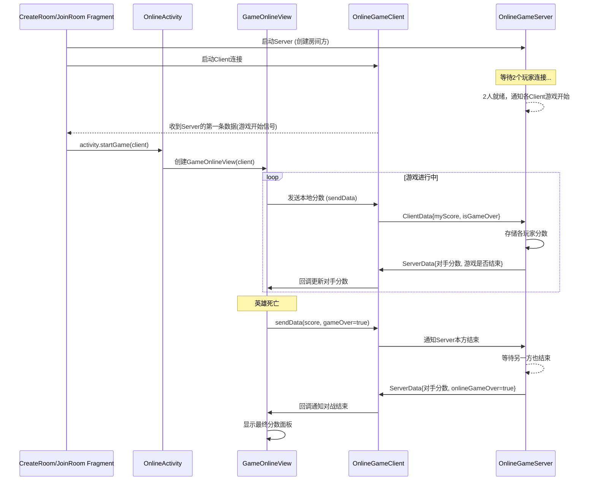

# AircraftWar Android

## 背景

HITSZ软件构造实践，基于之前实现的[Windows版本](https://github.com/cuijunjie18/AircraftWar.git) 进行迁移

## 预期规划

- [x] 实现Windows到Android的迁移(目前实现了初始版)
- [x] 使用kotlin重写
- [x] 添加网络功能，实现联机

## 网络联机时序图一览

## 待优化问题

- [ ] 增加无线，无wifi近场联机
- [ ] 优化联机模式下的网络服务架构
- [ ] Activity间的执行栈顺序优化，menu->game->rank，优化为循环，即rank回退是menu,而非game

## 收获

具体见[项目学习笔记](docs/notebook.md)