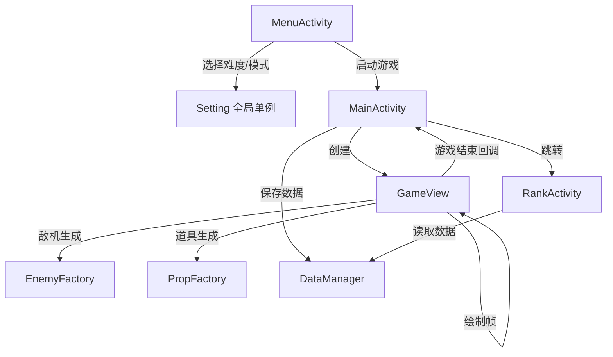
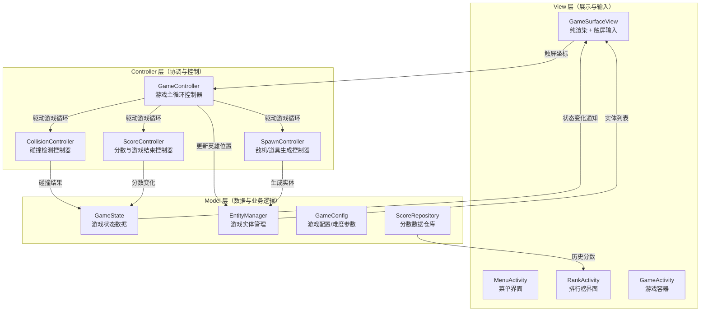
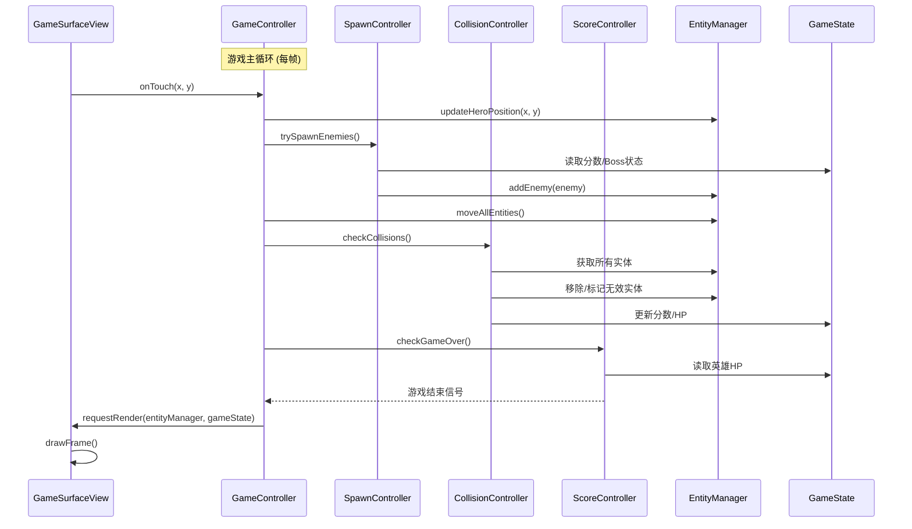
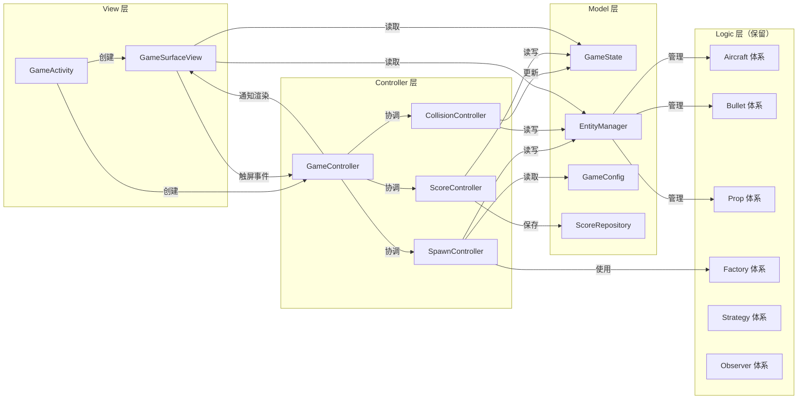

# AircraftWar Android 客户端 MVC 重构架构文档

---

## 一、现有架构全面分析

### 1.1 项目概述

AircraftWar 是一款基于 Android 平台的单机飞机大战游戏，使用 Kotlin 语言开发，支持单机模式（简单/中等/困难）和联机对战模式。游戏采用 `SurfaceView` 进行高性能渲染，通过触屏控制英雄飞机移动。

### 1.2 当前目录结构

```
edu.hitsz.aircraftwar/
├── AircraftWarApplication.kt          # Application 全局上下文
├── ActivityCollector.kt               # Activity 生命周期管理
├── MainActivity.kt                    # 单机游戏 Activity
├── Views/
│   ├── BaseActivity.kt                # Activity 基类
│   ├── MenuActivity.kt                # 主菜单界面
│   ├── OnlineActivity.kt              # 联机模式入口
│   ├── RankActivity.kt                # 排行榜界面
│   ├── GameView.kt                    # 单机游戏主视图（核心，578行）
│   ├── GameOnlineView.kt              # 联机游戏主视图（核心，690行）
│   ├── ScoreItemData.kt               # 排行榜 RecyclerView 适配器
│   └── fragments/
│       ├── CreateRoomFragment.kt      # 创建房间 Fragment
│       └── JoinRoomFragment.kt        # 加入房间 Fragment
├── data/
│   ├── DataManager.kt                 # 数据持久化管理（文件读写）
│   └── SingleGameInfo.kt              # 单局游戏数据模型
├── logic/
│   ├── basic/
│   │   └── AbstractFlyingObject.kt    # 飞行物基类
│   ├── aircraft/
│   │   ├── AbstractAircraft.kt        # 飞机抽象类
│   │   ├── HeroAircraft.kt            # 英雄飞机
│   │   ├── MobEnemy.kt                # 普通敌机
│   │   ├── EliteEnemy.kt              # 精英敌机
│   │   ├── SuperEliteEnemy.kt         # 超级精英敌机
│   │   └── BossEnemy.kt               # Boss 敌机
│   ├── bullet/
│   │   ├── BaseBullet.kt              # 子弹基类
│   │   ├── HeroBullet.kt              # 英雄子弹
│   │   └── EnemyBullet.kt             # 敌机子弹
│   ├── prop/
│   │   ├── BaseProp.kt                # 道具基类
│   │   ├── PropBlood.kt               # 血量道具
│   │   ├── PropBomb.kt                # 炸弹道具
│   │   ├── PropBullet.kt              # 子弹道具
│   │   └── PropBulletPlus.kt          # 高级子弹道具
│   ├── factory/
│   │   ├── EnemyFactory.kt            # 敌机工厂接口
│   │   ├── MobEnemyFactory.kt         # 普通敌机工厂
│   │   ├── EliteEnemyFactory.kt       # 精英敌机工厂
│   │   ├── SuperEliteEnemyFactory.kt  # 超级精英敌机工厂
│   │   ├── BossEnemyFactory.kt        # Boss 工厂
│   │   ├── PropFactory.kt             # 道具工厂接口
│   │   ├── PropBloodFactory.kt        # 血量道具工厂
│   │   ├── PropBombFactory.kt         # 炸弹道具工厂
│   │   ├── PropBulletFactory.kt       # 子弹道具工厂
│   │   └── PropBulletPlusFactory.kt   # 高级子弹道具工厂
│   ├── strategy/
│   │   ├── ShootStrategy.kt           # 射击策略接口
│   │   ├── NormalShoot.kt             # 普通射击
│   │   ├── ScatterShoot.kt            # 散射
│   │   ├── WaveShoot.kt               # 波浪射击
│   │   └── NoneShoot.kt               # 不射击
│   ├── observer/
│   │   ├── Subject.kt                 # 观察者接口
│   │   └── BombSubject.kt             # 炸弹观察者主题
│   ├── difficulty/
│   │   ├── Difficulty.kt              # 难度抽象类
│   │   ├── Easy.kt                    # 简单难度
│   │   ├── Medium.kt                  # 中等难度
│   │   └── Hard.kt                    # 困难难度
│   └── utils/
│       ├── ImageManager.kt            # 图片资源管理
│       └── Utils.kt                   # 工具类
├── setting/
│   ├── Setting.kt                     # 全局设置（单例）
│   └── Music/
│       └── MusicManager.kt            # 音乐/音效管理
└── feature-Online/                    # 联机模块（独立 module）
    ├── OnlineData.kt                  # 联机数据模型
    ├── OnlineGameClient.kt            # 联机客户端
    └── OnlineGameServer.kt            # 联机服务端
```

### 1.3 当前架构组成

当前项目**没有明确的架构模式**，呈现出一种"以 View 为中心"的混合结构：

| 层次 | 组件 | 职责 |
|------|------|------|
| **视图层** | `GameView` / `GameOnlineView` | 游戏渲染 + 游戏逻辑 + 状态管理 + 输入处理 |
| **Activity 层** | `MainActivity` / `MenuActivity` / `RankActivity` | 界面容器 + 部分业务逻辑 |
| **数据层** | `DataManager` / `SingleGameInfo` | 数据持久化 |
| **逻辑实体层** | `logic/` 包下所有类 | 游戏对象定义 + 设计模式实现 |
| **设置层** | `Setting` / `MusicManager` | 全局配置 + 音频管理 |

### 1.4 当前数据流



### 1.5 当前设计模式使用情况

| 设计模式 | 实现位置 | 说明 |
|----------|----------|------|
| **工厂模式** | `logic/factory/` | `EnemyFactory` / `PropFactory` 接口 + 具体工厂类 |
| **策略模式** | `logic/strategy/` | `ShootStrategy` 接口 + 多种射击策略 |
| **观察者模式** | `logic/observer/` | `Subject` 接口 + `BombSubject` 实现炸弹全屏效果 |
| **单例模式** | `Setting` / `MusicManager` / `DataManager` / `ImageManager` | Kotlin `object` 关键字实现 |

---

## 二、当前架构问题与不足

### 2.1 🔴 核心问题：GameView 严重违反单一职责原则（God Object）

`GameView.kt`（578行）和 `GameOnlineView.kt`（690行）是整个项目最严重的问题。这两个类承担了**至少 6 种不同的职责**：

| 职责 | 代码体现 |
|------|----------|
| **游戏状态管理** | `score`、`gameOverFlag`、`bossExistFlag`、`bossKillCount` 等状态变量 |
| **游戏对象管理** | `heroAircraft`、`enemyAircrafts`、`heroBullets`、`enemyBullets`、`props` 列表管理 |
| **游戏逻辑处理** | `shootAction()`、`crashCheckAction()`、`postProcessAction()`、`generateProp()` |
| **敌机生成调度** | `run()` 中的敌机生成逻辑、Boss 生成条件判断 |
| **渲染绘制** | `drawFrame()`、`drawGame()`、`drawObjects()`、`drawScoreAndLife()` |
| **输入处理** | `onTouchEvent()` 处理触屏控制 |
| **生命周期管理** | `surfaceCreated()`、`surfaceDestroyed()`、`startGame()`、`overGame()` |

**影响**：
- 修改任何一个功能都需要在这个巨大的类中定位和修改
- 无法对游戏逻辑进行单元测试（与 Android View 强耦合）
- 新增功能（如新敌机类型、新道具效果）需要修改核心类

### 2.2 🔴 GameView 与 GameOnlineView 大量代码重复

两个文件之间存在**约 80% 的代码重复**，包括：
- 完全相同的游戏对象声明和工厂实例化
- 完全相同的 `shootAction()`、`bulletsMoveAction()`、`aircraftsMoveAction()`、`propsMoveAction()`
- 完全相同的 `crashCheckAction()`、`postProcessAction()`
- 完全相同的 `generateProp()`
- 几乎相同的 `drawGame()`、`drawObjects()`
- 几乎相同的 `surfaceCreated()` 初始化逻辑

**影响**：
- 修复一个 bug 需要在两个文件中同步修改
- 新增功能需要在两处重复实现
- 极易出现不一致性

### 2.3 🟡 View 层直接操作业务逻辑

`GameView` 中直接包含了：
- 敌机生成概率计算（`enemyRate`、`propRate`）
- Boss 生成条件判断（`score >= (bossKillCount + 1) * 300`）
- 碰撞检测算法
- 分数计算逻辑
- 道具效果处理

这些**纯业务逻辑**不应该存在于 View 层，导致：
- 无法脱离 Android 环境测试游戏逻辑
- View 层过于臃肿
- 逻辑与展示强耦合

### 2.4 🟡 Difficulty 系统未真正生效

`Difficulty` 抽象类定义了 `eliteProbability`、`enemyCycle`、`enemyAbility` 等属性，`Medium` 和 `Hard` 类重写了 `improve_difficulty()` 方法，但在 `GameView` 中：
- 敌机生成概率是**硬编码**的（`enemyRate = 10`，固定 70%/20%/10%）
- 难度仅影响背景图片和 Boss 是否生成
- `Difficulty` 类的属性从未被 `GameView` 读取和使用

### 2.5 🟡 Setting 全局单例滥用

`Setting` 作为全局单例，被 `GameView`、`MenuActivity`、`MusicManager`、`DataManager` 等多处直接访问：
- 形成隐式依赖，难以追踪数据流
- 无法在测试中替换或 mock
- `onlineMode` 状态管理不清晰（设置后未重置）

### 2.6 🟡 MainActivity 中存在业务逻辑

`MainActivity.gameOver()` 方法中包含了：
- 构建 `SingleGameInfo` 数据对象
- 调用 `DataManager.saveData()` 保存数据
- 控制游戏线程停止

这些逻辑应该由专门的 Controller 或 ViewModel 处理。

### 2.7 🟢 PropBomb 观察者模式实现冗余

`PropBomb` 类内部自行实现了一套观察者模式（`registerObserver`、`removeObserver`、`notifyObservers`），同时 `GameView` 中又使用了 `BombSubject` 来管理观察者。两套机制并存，`PropBomb.action()` 调用自身的 `notifyObservers()`，而 `GameView` 中又调用 `bombSubject.notifyObservers()`，存在逻辑混乱。

### 2.8 🟢 线程安全问题

`GameView` 中的游戏对象列表（`enemyAircrafts`、`heroBullets` 等）在游戏线程中修改，在 UI 线程的 `onTouchEvent` 中读取 `heroAircraft`，没有同步机制。`GameOnlineView` 中 `opponentScore` 使用了 `@Volatile`，但其他共享状态未做保护。

### 2.9 🟢 ImageManager 与游戏对象耦合

`AbstractFlyingObject.getWidthVal()` / `getHeightVal()` 直接调用 `ImageManager.get(this)` 获取图片尺寸，导致：
- 游戏逻辑对象依赖渲染资源
- 无法在无图片环境下进行逻辑测试

---

## 三、MVC 重构方案设计

### 3.1 MVC 架构总体设计



### 3.2 各层职责划分

#### 3.2.1 Model 层

Model 层负责**游戏数据的存储和业务规则**，不依赖任何 Android 框架类。

| 类名 | 职责 | 说明 |
|------|------|------|
| `GameState` | 游戏运行状态 | 分数、游戏是否结束、Boss 状态、当前周期等 |
| `EntityManager` | 游戏实体集合管理 | 管理所有飞行物列表（英雄、敌机、子弹、道具），提供增删查接口 |
| `GameConfig` | 游戏配置参数 | 根据难度提供敌机生成概率、最大敌机数、Boss 生成阈值等参数 |
| `ScoreRepository` | 分数数据仓库 | 封装 `DataManager` 的读写操作，提供统一的数据访问接口 |
| `SingleGameInfo` | 单局数据模型 | 保持不变 |
| 现有 `logic/` 包 | 游戏实体定义 | `AbstractFlyingObject`、各类飞机、子弹、道具、工厂、策略、观察者等保持不变 |

#### 3.2.2 View 层

View 层**只负责渲染和用户输入采集**，不包含任何游戏逻辑。

| 类名 | 职责 | 说明 |
|------|------|------|
| `GameSurfaceView` | 游戏画面渲染 | 仅负责将 Controller 提供的实体列表绘制到 Canvas 上，以及采集触屏事件转发给 Controller |
| `GameActivity` | 游戏 Activity 容器 | 替代现有 `MainActivity`，负责创建 View 和 Controller，管理生命周期 |
| `MenuActivity` | 主菜单 | 保持不变，负责难度选择和模式切换 |
| `RankActivity` | 排行榜 | 保持不变，从 `ScoreRepository` 获取数据 |
| `ScoreAdapter` | 排行榜适配器 | 保持不变 |

#### 3.2.3 Controller 层

Controller 层**协调 Model 和 View**，包含游戏主循环和各子系统的控制逻辑。

| 类名 | 职责 | 说明 |
|------|------|------|
| `GameController` | 游戏主循环控制器 | 驱动游戏循环（`run()`），协调各子控制器，管理游戏线程 |
| `SpawnController` | 生成控制器 | 根据 `GameConfig` 的参数控制敌机和道具的生成逻辑 |
| `CollisionController` | 碰撞控制器 | 处理所有碰撞检测逻辑，更新实体状态和游戏状态 |
| `ScoreController` | 分数控制器 | 管理分数计算、游戏结束判定、数据保存 |
| `InputController` | 输入控制器 | 处理触屏输入，更新英雄飞机位置 |
| `OnlineGameController` | 联机游戏控制器 | 继承/组合 `GameController`，增加网络同步逻辑 |

### 3.3 重构后的目录结构

```
edu.hitsz.aircraftwar/
├── AircraftWarApplication.kt
├── ActivityCollector.kt
│
├── model/                              # ← Model 层
│   ├── state/
│   │   └── GameState.kt                # 游戏运行状态
│   ├── entity/
│   │   └── EntityManager.kt            # 游戏实体集合管理
│   ├── config/
│   │   └── GameConfig.kt               # 游戏配置（整合 Difficulty）
│   ├── repository/
│   │   └── ScoreRepository.kt          # 分数数据仓库
│   └── data/
│       ├── DataManager.kt              # 底层数据持久化（保留）
│       └── SingleGameInfo.kt           # 数据模型（保留）
│
├── view/                               # ← View 层
│   ├── activity/
│   │   ├── BaseActivity.kt
│   │   ├── GameActivity.kt             # 替代 MainActivity
│   │   ├── MenuActivity.kt
│   │   ├── RankActivity.kt
│   │   └── OnlineActivity.kt
│   ├── game/
│   │   ├── GameSurfaceView.kt          # 纯渲染视图
│   │   └── GameRenderer.kt             # 渲染辅助类（绘制逻辑）
│   ├── adapter/
│   │   └── ScoreAdapter.kt
│   └── fragments/
│       ├── CreateRoomFragment.kt
│       └── JoinRoomFragment.kt
│
├── controller/                         # ← Controller 层
│   ├── GameController.kt               # 游戏主循环控制器
│   ├── SpawnController.kt              # 敌机/道具生成控制器
│   ├── CollisionController.kt          # 碰撞检测控制器
│   ├── ScoreController.kt              # 分数管理控制器
│   ├── InputController.kt              # 输入处理控制器
│   └── OnlineGameController.kt         # 联机游戏控制器
│
├── logic/                              # 游戏实体与设计模式（保留）
│   ├── basic/
│   │   └── AbstractFlyingObject.kt
│   ├── aircraft/
│   ├── bullet/
│   ├── prop/
│   ├── factory/
│   ├── strategy/
│   ├── observer/
│   ├── difficulty/
│   └── utils/
│       ├── ImageManager.kt
│       └── Utils.kt
│
└── setting/
    ├── Setting.kt
    └── Music/
        └── MusicManager.kt
```

### 3.4 重构后的数据流



---

## 四、核心类详细设计

### 4.1 GameState（游戏状态）

```kotlin
// model/state/GameState.kt
class GameState {
    var score: Int = 0
    var gameOverFlag: Boolean = false
    var bossExistFlag: Boolean = false
    var bossKillCount: Int = 0
    var cycleTime: Int = 0

    // 联机模式扩展
    var opponentScore: Int = 0
    var onlineAllOver: Boolean = false

    fun reset() {
        score = 0
        gameOverFlag = false
        bossExistFlag = false
        bossKillCount = 0
        cycleTime = 0
    }
}
```

### 4.2 EntityManager（实体管理器）

```kotlin
// model/entity/EntityManager.kt
class EntityManager {
    lateinit var heroAircraft: HeroAircraft
    val enemyAircrafts: MutableList<AbstractAircraft> = mutableListOf()
    val heroBullets: MutableList<BaseBullet> = mutableListOf()
    val enemyBullets: MutableList<BaseBullet> = mutableListOf()
    val props: MutableList<BaseProp> = mutableListOf()
    val bombSubject: BombSubject = BombSubject()

    fun initHero(x: Int, y: Int) {
        heroAircraft = HeroAircraft(x, y, 0, 0, 100)
        heroAircraft.setShootStrategy("NORMAL")
    }

    fun moveAllEntities() {
        enemyAircrafts.forEach { it.forward() }
        heroBullets.forEach { it.forward() }
        enemyBullets.forEach { it.forward() }
        props.forEach { it.forward() }
    }

    fun removeInvalidEntities(): List<AbstractAircraft> {
        // 返回本帧被移除的敌机列表（用于计分）
        val removed = enemyAircrafts.filter { it.notValid() }
        removed.forEach { bombSubject.removeObserver(it) }

        val removedBullets = enemyBullets.filter { it.notValid() }
        removedBullets.forEach { bombSubject.removeObserver(it) }

        enemyAircrafts.removeAll { it.notValid() }
        heroBullets.removeAll { it.notValid() }
        enemyBullets.removeAll { it.notValid() }
        props.removeAll { it.notValid() }

        return removed
    }
}
```

### 4.3 GameConfig（游戏配置）

```kotlin
// model/config/GameConfig.kt
class GameConfig(difficulty: Difficulty) {
    val enemyMaxNumber: Int
    val enemyRate: Int = 10
    val propRate: Int = 10
    val bossScoreThreshold: Int = 300
    val cycleDuration: Int = 1200
    val timeInterval: Int = 40
    val targetFps: Int

    // 真正使用 Difficulty 的参数
    val eliteProbability: Double
    val enemyAbility: Double

    init {
        when (difficulty) {
            is Easy -> {
                enemyMaxNumber = 4
                targetFps = 60
                eliteProbability = difficulty.eliteProbability
                enemyAbility = difficulty.enemyAbility
            }
            is Medium -> {
                enemyMaxNumber = 5
                targetFps = 60
                eliteProbability = difficulty.eliteProbability
                enemyAbility = difficulty.enemyAbility
            }
            is Hard -> {
                enemyMaxNumber = 6
                targetFps = 60
                eliteProbability = difficulty.eliteProbability
                enemyAbility = difficulty.enemyAbility
            }
            else -> {
                enemyMaxNumber = 5
                targetFps = 60
                eliteProbability = 0.2
                enemyAbility = 1.0
            }
        }
    }
}
```

### 4.4 GameController（游戏主控制器）

```kotlin
// controller/GameController.kt
class GameController(
    private val gameConfig: GameConfig,
    private val entityManager: EntityManager,
    private val gameState: GameState,
    private val onGameOver: (Int) -> Unit
) : Runnable {

    private val spawnController = SpawnController(gameConfig, entityManager, gameState)
    private val collisionController = CollisionController(entityManager, gameState)
    private val scoreController = ScoreController(gameState)

    private var gameThread: Thread? = null
    private var isRunning = false

    // View 层回调接口
    var onFrameReady: (() -> Unit)? = null

    fun start() {
        isRunning = true
        gameThread = Thread(this, "GameLoop").apply { start() }
        MusicManager.switchNormalBgm()
    }

    fun stop() {
        isRunning = false
        gameThread?.join()
    }

    fun handleTouchInput(x: Float, y: Float) {
        entityManager.heroAircraft.setLocation(x.toDouble(), y.toDouble())
    }

    override fun run() {
        val frameInterval = 1000L / gameConfig.targetFps
        while (isRunning && !gameState.gameOverFlag) {
            val startTime = System.currentTimeMillis()

            // 1. 生成敌机
            if (timeCountAndNewCycleJudge()) {
                spawnController.spawnEnemies()
                spawnController.shootAll()
            }

            // 2. 移动所有实体
            entityManager.moveAllEntities()

            // 3. 碰撞检测
            collisionController.checkAllCollisions()

            // 4. 后处理（移除无效实体 + 计分）
            scoreController.processRemovedEntities(entityManager.removeInvalidEntities())

            // 5. 通知 View 绘制
            onFrameReady?.invoke()

            // 6. 检查游戏结束
            if (entityManager.heroAircraft.hp <= 0) {
                gameState.gameOverFlag = true
                MusicManager.stopBgm()
                MusicManager.playSound(MusicManager.SoundType.GAME_OVER)
                onGameOver(gameState.score)
            }

            // 帧率控制
            val elapsed = System.currentTimeMillis() - startTime
            val sleepTime = frameInterval - elapsed
            if (sleepTime > 0) Thread.sleep(sleepTime)
        }
    }

    private fun timeCountAndNewCycleJudge(): Boolean {
        gameState.cycleTime += gameConfig.timeInterval
        if (gameState.cycleTime >= gameConfig.cycleDuration) {
            gameState.cycleTime %= gameConfig.cycleDuration
            return true
        }
        return false
    }
}
```

### 4.5 GameSurfaceView（纯渲染视图）

```kotlin
// view/game/GameSurfaceView.kt
class GameSurfaceView(
    context: Context,
    private val entityManager: EntityManager,
    private val gameState: GameState
) : SurfaceView(context), SurfaceHolder.Callback {

    private val paint = Paint(Paint.ANTI_ALIAS_FLAG)
    private val textPaint = Paint(Paint.ANTI_ALIAS_FLAG).apply {
        color = Color.RED
        textSize = 48f
        typeface = Typeface.DEFAULT_BOLD
    }
    private var backgroundBitmap: Bitmap? = null
    private var backgroundTop: Int = 0

    // 触屏事件回调
    var onTouchInput: ((Float, Float) -> Unit)? = null
    // Surface 就绪回调
    var onSurfaceReady: ((Int, Int) -> Unit)? = null

    init {
        holder.addCallback(this)
        isFocusable = true
        isFocusableInTouchMode = true
    }

    override fun surfaceCreated(holder: SurfaceHolder) {
        initBackground()
        onSurfaceReady?.invoke(width, height)
    }

    override fun surfaceChanged(holder: SurfaceHolder, f: Int, w: Int, h: Int) {}
    override fun surfaceDestroyed(holder: SurfaceHolder) {}

    fun render() {
        var canvas: Canvas? = null
        try {
            canvas = holder.lockCanvas()
            if (canvas != null) drawGame(canvas)
        } finally {
            canvas?.let { holder.unlockCanvasAndPost(it) }
        }
    }

    override fun onTouchEvent(event: MotionEvent): Boolean {
        when (event.action) {
            MotionEvent.ACTION_MOVE, MotionEvent.ACTION_DOWN -> {
                onTouchInput?.invoke(event.x, event.y)
            }
        }
        return true
    }

    // 纯绘制方法，不包含任何逻辑
    private fun drawGame(canvas: Canvas) { /* 绘制背景、实体、UI */ }
    private fun drawObjects(canvas: Canvas, objects: List<AbstractFlyingObject>) { /* ... */ }
    private fun drawScoreAndLife(canvas: Canvas) { /* ... */ }
}
```

---

## 五、重构后模块交互关系



---

## 六、重构实施步骤

### 阶段一：提取 Model 层（低风险）

| 步骤 | 操作 | 影响范围 |
|------|------|----------|
| 1.1 | 创建 `model/state/GameState.kt`，将 `GameView` 中的状态变量（`score`、`gameOverFlag`、`bossExistFlag`、`bossKillCount`、`cycleTime`）提取到此类 | `GameView`、`GameOnlineView` |
| 1.2 | 创建 `model/entity/EntityManager.kt`，将实体列表管理（`heroAircraft`、`enemyAircrafts`、`heroBullets`、`enemyBullets`、`props`、`bombSubject`）和移动/清理方法提取到此类 | `GameView`、`GameOnlineView` |
| 1.3 | 创建 `model/config/GameConfig.kt`，整合 `Difficulty` 参数，替代 `GameView` 中的硬编码配置 | `GameView`、`GameOnlineView`、`Difficulty` |
| 1.4 | 创建 `model/repository/ScoreRepository.kt`，封装 `DataManager` 的调用 | `MainActivity`、`RankActivity` |

### 阶段二：提取 Controller 层（中风险）

| 步骤 | 操作 | 影响范围 |
|------|------|----------|
| 2.1 | 创建 `controller/SpawnController.kt`，将敌机生成逻辑（`run()` 中的生成部分 + `generateProp()`）提取 | `GameView` |
| 2.2 | 创建 `controller/CollisionController.kt`，将 `crashCheckAction()` 完整提取 | `GameView` |
| 2.3 | 创建 `controller/ScoreController.kt`，将 `postProcessAction()` 中的计分逻辑提取 | `GameView` |
| 2.4 | 创建 `controller/GameController.kt`，将游戏主循环（`run()`）、帧率控制、周期判断提取，组合调用各子控制器 | `GameView` |
| 2.5 | 创建 `controller/OnlineGameController.kt`，继承 `GameController`，增加网络同步逻辑 | `GameOnlineView` |

### 阶段三：重构 View 层（中风险）

| 步骤 | 操作 | 影响范围 |
|------|------|----------|
| 3.1 | 将 `GameView` 重构为 `GameSurfaceView`，仅保留渲染和触屏输入功能 | `GameView` |
| 3.2 | 将 `MainActivity` 重构为 `GameActivity`，负责创建 Model、Controller、View 并连接 | `MainActivity` |
| 3.3 | 统一 `GameView` 和 `GameOnlineView` 的渲染逻辑到 `GameSurfaceView`，联机特有的 UI（等待遮罩、结果显示）通过状态判断绘制 | `GameOnlineView` |

### 阶段四：修复遗留问题（低风险）

| 步骤 | 操作 | 影响范围 |
|------|------|----------|
| 4.1 | 让 `GameConfig` 真正使用 `Difficulty` 的参数控制敌机生成概率和能力 | `SpawnController`、`GameConfig` |
| 4.2 | 清理 `PropBomb` 中冗余的观察者实现，统一使用 `BombSubject` | `PropBomb`、`CollisionController` |
| 4.3 | 解耦 `AbstractFlyingObject` 对 `ImageManager` 的依赖，改为在初始化时注入宽高 | `AbstractFlyingObject`、`Factory` 类 |
| 4.4 | 为 `EntityManager` 的列表操作添加同步机制（`synchronized` 或 `CopyOnWriteArrayList`） | `EntityManager` |

---

## 七、重构前后对比

### 7.1 代码行数对比（预估）

| 文件 | 重构前 | 重构后 |
|------|--------|--------|
| `GameView.kt` | 578 行 | **删除**（拆分为以下文件） |
| `GameOnlineView.kt` | 690 行 | **删除**（拆分为以下文件） |
| `GameSurfaceView.kt` | - | ~150 行 |
| `GameController.kt` | - | ~120 行 |
| `OnlineGameController.kt` | - | ~80 行 |
| `SpawnController.kt` | - | ~80 行 |
| `CollisionController.kt` | - | ~100 行 |
| `ScoreController.kt` | - | ~50 行 |
| `GameState.kt` | - | ~30 行 |
| `EntityManager.kt` | - | ~80 行 |
| `GameConfig.kt` | - | ~50 行 |
| **总计** | **1268 行（2个文件）** | **~740 行（10个文件）** |

### 7.2 职责对比

| 职责 | 重构前（所在类） | 重构后（所在类） |
|------|------------------|------------------|
| 游戏状态存储 | `GameView` | `GameState` (Model) |
| 实体列表管理 | `GameView` | `EntityManager` (Model) |
| 游戏配置 | `GameView` 硬编码 | `GameConfig` (Model) |
| 敌机生成 | `GameView.run()` | `SpawnController` (Controller) |
| 碰撞检测 | `GameView.crashCheckAction()` | `CollisionController` (Controller) |
| 分数计算 | `GameView.postProcessAction()` | `ScoreController` (Controller) |
| 游戏主循环 | `GameView.run()` | `GameController` (Controller) |
| 画面渲染 | `GameView.drawXxx()` | `GameSurfaceView` (View) |
| 触屏输入 | `GameView.onTouchEvent()` | `GameSurfaceView` (View) |
| 数据保存 | `MainActivity.gameOver()` | `ScoreRepository` (Model) |

### 7.3 可测试性对比

| 测试类型 | 重构前 | 重构后 |
|----------|--------|--------|
| 碰撞检测单元测试 | ❌ 无法测试（嵌入 SurfaceView） | ✅ `CollisionController` 可独立测试 |
| 敌机生成逻辑测试 | ❌ 无法测试 | ✅ `SpawnController` 可独立测试 |
| 分数计算测试 | ❌ 无法测试 | ✅ `ScoreController` 可独立测试 |
| 游戏状态测试 | ❌ 无法测试 | ✅ `GameState` 纯数据类可测试 |
| 难度配置测试 | ❌ 无法测试 | ✅ `GameConfig` 可独立测试 |

---

## 八、风险评估与注意事项

### 8.1 风险点

| 风险 | 等级 | 应对措施 |
|------|------|----------|
| 游戏循环线程与渲染线程同步 | 高 | `GameController` 通过回调通知 `GameSurfaceView` 渲染，使用 `synchronized` 保护共享数据 |
| 联机模式网络回调线程安全 | 高 | `OnlineGameController` 中使用 `@Volatile` 和 `synchronized` 保护网络数据 |
| 重构过程中功能回归 | 中 | 分阶段实施，每阶段完成后进行完整功能测试 |
| 性能影响 | 低 | 新增的方法调用开销可忽略，实体管理集中化反而可能提升性能 |

### 8.2 注意事项

1. **保持 `logic/` 包不变**：现有的工厂模式、策略模式、观察者模式设计良好，无需修改
2. **渐进式重构**：建议按阶段一→二→三→四的顺序逐步实施，每步确保游戏可正常运行
3. **`feature-Online` 模块保持独立**：联机通信模块（`OnlineGameClient`/`OnlineGameServer`）作为独立 module 保持不变
4. **`Setting` 和 `MusicManager` 暂时保留**：这两个全局单例虽然不够理想，但重构优先级较低，可在后续迭代中改为依赖注入

---

## 九、总结

当前项目的核心问题在于 `GameView` 承担了过多职责（God Object），且单机/联机两个 View 存在大量代码重复。通过 MVC 架构重构：

- **Model 层**：将游戏状态、实体管理、配置参数从 View 中剥离，形成独立的、可测试的数据层
- **View 层**：`GameSurfaceView` 仅负责渲染和输入采集，代码量从 578/690 行降至约 150 行
- **Controller 层**：将游戏逻辑拆分为多个专职控制器，每个控制器职责单一、可独立测试

重构后，单机和联机模式共享同一套 Model 和 View，仅通过不同的 Controller（`GameController` vs `OnlineGameController`）实现差异化逻辑，彻底消除代码重复。

---

## 十、重构实施记录

### 10.1 已完成的重构工作

#### 阶段一：Model 层（已完成 ✅）

| 文件 | 路径 | 说明 |
|------|------|------|
| `GameState.kt` | `model/state/` | 统一管理游戏运行状态（分数、游戏结束标志、Boss状态、联机扩展字段） |
| `EntityManager.kt` | `model/entity/` | 统一管理所有游戏飞行物实体集合，提供初始化、移动、清理接口 |
| `GameConfig.kt` | `model/config/` | 根据难度整合所有游戏参数配置（帧率、敌机数量、精英概率等） |
| `ScoreRepository.kt` | `model/repository/` | 封装 DataManager 读写操作，提供统一数据访问接口 |

#### 阶段二：Controller 层（已完成 ✅）

| 文件 | 路径 | 说明 |
|------|------|------|
| `GameController.kt` | `controller/` | 游戏主循环控制器，协调各子控制器 |
| `SpawnController.kt` | `controller/` | 敌机/道具生成控制器 |
| `CollisionController.kt` | `controller/` | 碰撞检测控制器 |
| `ScoreController.kt` | `controller/` | 分数计算控制器 |
| `OnlineGameController.kt` | `controller/` | 联机游戏控制器，继承 GameController |

#### 阶段三：View 层（已完成 ✅）

| 文件 | 路径 | 说明 |
|------|------|------|
| `GameSurfaceView.kt` | `view/game/` | 纯渲染视图，支持单机/联机两种模式 |
| `GameActivity.kt` | `view/activity/` | 单机游戏 Activity，替代 MainActivity |
| `OnlineGameActivity.kt` | `view/activity/` | 联机游戏 Activity，替代 OnlineActivity |

#### 阶段四：集成与适配（已完成 ✅）

| 修改文件 | 说明 |
|----------|------|
| `MenuActivity.kt` | 将 Intent 指向新的 GameActivity 和 OnlineGameActivity |
| `CreateRoomFragment.kt` | 将 OnlineActivity 引用改为 OnlineGameActivity |
| `JoinRoomFragment.kt` | 将 OnlineActivity 引用改为 OnlineGameActivity |
| `AndroidManifest.xml` | 注册新的 GameActivity 和 OnlineGameActivity |

### 10.2 重构后的最终目录结构

```
edu.hitsz.aircraftwar/
├── AircraftWarApplication.kt           # Application 全局上下文（保留）
├── ActivityCollector.kt                # Activity 生命周期管理（保留）
├── MainActivity.kt                    # 旧单机游戏 Activity（保留，不再使用）
│
├── model/                              # ← Model 层（新增）
│   ├── state/
│   │   └── GameState.kt               # 游戏运行状态
│   ├── entity/
│   │   └── EntityManager.kt           # 游戏实体集合管理
│   ├── config/
│   │   └── GameConfig.kt              # 游戏配置（整合 Difficulty）
│   └── repository/
│       └── ScoreRepository.kt         # 分数数据仓库
│
├── view/                               # ← View 层（新增）
│   ├── activity/
│   │   ├── GameActivity.kt            # 单机游戏 Activity（替代 MainActivity）
│   │   └── OnlineGameActivity.kt      # 联机游戏 Activity（替代 OnlineActivity）
│   └── game/
│       └── GameSurfaceView.kt         # 纯渲染视图（替代 GameView + GameOnlineView）
│
├── controller/                         # ← Controller 层（新增）
│   ├── GameController.kt              # 游戏主循环控制器
│   ├── SpawnController.kt             # 敌机/道具生成控制器
│   ├── CollisionController.kt         # 碰撞检测控制器
│   ├── ScoreController.kt             # 分数管理控制器
│   └── OnlineGameController.kt        # 联机游戏控制器
│
├── Views/                              # 旧 View 层（部分保留）
│   ├── BaseActivity.kt                # Activity 基类（保留）
│   ├── MenuActivity.kt                # 主菜单界面（已修改）
│   ├── RankActivity.kt                # 排行榜界面（保留）
│   ├── ScoreItemData.kt               # 排行榜适配器（保留）
│   ├── GameView.kt                    # 旧单机游戏视图（保留，不再使用）
│   ├── GameOnlineView.kt              # 旧联机游戏视图（保留，不再使用）
│   ├── OnlineActivity.kt              # 旧联机入口（保留，不再使用）
│   └── fragments/
│       ├── CreateRoomFragment.kt      # 创建房间（已修改）
│       └── JoinRoomFragment.kt        # 加入房间（已修改）
│
├── data/                               # 数据层（保留）
│   ├── DataManager.kt
│   └── SingleGameInfo.kt
│
├── logic/                              # 游戏实体与设计模式（保留）
│   ├── basic/
│   ├── aircraft/
│   ├── bullet/
│   ├── prop/
│   ├── factory/
│   ├── strategy/
│   ├── observer/
│   ├── difficulty/
│   └── utils/
│
└── setting/                            # 设置层（保留）
    ├── Setting.kt
    └── Music/
        └── MusicManager.kt
```

---

## 十一、模块接口文档

### 11.1 Model 层接口

#### GameState - 游戏状态

```kotlin
class GameState {
    var score: Int                    // 当前分数
    var gameOverFlag: Boolean         // 游戏是否结束
    var bossExistFlag: Int            // Boss是否存在 (0/1)
    var bossKillCount: Int            // 已击杀Boss数量
    var cycleTime: Int                // 当前周期时间
    var opponentScore: Int            // 对手分数（联机）
    var onlineAllOver: Boolean        // 对战是否全部结束（联机）
    var lastSentScore: Int            // 上次发送的分数（联机）

    fun reset()                       // 重置所有状态
    fun addScore(points: Int)         // 增加分数
    fun markBossSpawned()             // 标记Boss已生成
    fun markBossKilled()              // 标记Boss已击杀
    fun shouldSpawnBoss(difficultyStr: String): Boolean  // 检查是否应生成Boss
}
```

#### EntityManager - 实体管理器

```kotlin
class EntityManager {
    var heroAircraft: HeroAircraft    // 英雄飞机
    val enemyAircrafts: MutableList<AbstractAircraft>  // 敌机列表
    val heroBullets: MutableList<BaseBullet>            // 英雄子弹列表
    val enemyBullets: MutableList<BaseBullet>           // 敌机子弹列表
    val props: MutableList<BaseProp>                    // 道具列表
    val bombSubject: BombSubject                        // 炸弹观察者

    fun initHero(x: Int, y: Int)                        // 初始化英雄飞机
    fun isHeroInitialized(): Boolean                    // 检查英雄是否已初始化
    fun moveAllEntities()                               // 移动所有实体
    fun removeInvalidEntities(): List<AbstractAircraft> // 移除无效实体并返回被移除的敌机
    fun clearAll()                                      // 清空所有实体
}
```

#### GameConfig - 游戏配置

```kotlin
class GameConfig(val difficulty: Difficulty) {
    val enemyMaxNumber: Int           // 敌机最大数量
    val enemyRate: Int                // 敌机生成随机数范围
    val propRate: Int                 // 道具生成随机数范围
    val bossScoreThreshold: Int       // Boss生成分数阈值
    val cycleDuration: Int            // 子弹发射间隔周期
    val timeInterval: Int             // 时间间隔
    val targetFps: Int                // 目标帧率
    val frameInterval: Long           // 帧间隔
    val eliteProbability: Double      // 精英敌机概率
    val enemyAbility: Double          // 敌机能力倍率
    val difficultyStr: String         // 难度字符串标识
}
```

#### ScoreRepository - 分数数据仓库

```kotlin
object ScoreRepository {
    fun saveGameResult(score: Int)                       // 保存单局游戏数据
    fun loadScores(difficulty: String): List<SingleGameInfo>  // 加载指定难度历史分数
    fun loadCurrentDifficultyScores(): List<SingleGameInfo>  // 加载当前难度历史分数
}
```

### 11.2 Controller 层接口

#### GameController - 游戏主循环控制器

```kotlin
open class GameController(
    gameConfig: GameConfig,
    entityManager: EntityManager,
    gameState: GameState,
    onGameOver: (Int) -> Unit
) : Runnable {
    var onFrameReady: (() -> Unit)?   // View层渲染回调

    fun start()                       // 启动游戏
    fun pause()                       // 暂停游戏
    fun stop()                        // 停止游戏
    fun handleTouchInput(x: Float, y: Float)  // 处理触屏输入
}
```

#### SpawnController - 生成控制器

```kotlin
class SpawnController(gameConfig, entityManager, gameState) {
    fun spawnEnemies()                // 生成敌机
    fun shootAll()                    // 所有飞行器发射子弹
    fun generateProp(x: Int, y: Int)  // 在指定位置生成道具
    fun generatePropsForDestroyedEnemy(enemy: AbstractAircraft)  // 根据敌机类型生成道具
}
```

#### CollisionController - 碰撞检测控制器

```kotlin
class CollisionController(entityManager, gameState, spawnController) {
    fun checkAllCollisions()          // 执行所有碰撞检测
}
```

#### ScoreController - 分数控制器

```kotlin
class ScoreController(gameState) {
    fun processRemovedEntities(removedAircrafts: List<AbstractAircraft>)  // 处理被移除敌机的计分
}
```

#### OnlineGameController - 联机游戏控制器

```kotlin
class OnlineGameController(
    gameConfig, entityManager, gameState,
    client: OnlineGameClient,
    onOnlineGameOver: (Int) -> Unit
) : GameController {
    fun handleOnlineTouchInput(x: Float, y: Float)  // 联机模式触屏输入
    fun release()                                    // 释放资源
}
```

### 11.3 View 层接口

#### GameSurfaceView - 游戏渲染视图

```kotlin
class GameSurfaceView(context: Context) : SurfaceView, SurfaceHolder.Callback {
    var onTouchInput: ((Float, Float) -> Unit)?       // 触屏事件回调
    var onSurfaceReady: ((Int, Int) -> Unit)?         // Surface就绪回调
    var onSurfaceDestroyed: (() -> Unit)?             // Surface销毁回调

    fun bindModel(entityManager, gameState, isOnline: Boolean)  // 绑定Model数据
    fun render()                                       // 渲染一帧
}
```

#### GameActivity - 单机游戏Activity

```kotlin
class GameActivity : BaseActivity() {
    // 内部创建并连接 Model、Controller、View
    // 通过 ScoreRepository 保存游戏结果
    // 游戏结束后跳转到 RankActivity
}
```

#### OnlineGameActivity - 联机游戏Activity

```kotlin
class OnlineGameActivity : AppCompatActivity() {
    fun startGame(client: OnlineGameClient)  // 启动联机游戏
    // 内部创建并连接 Model、Controller、View
    // 使用 OnlineGameController 处理网络同步
}
```
