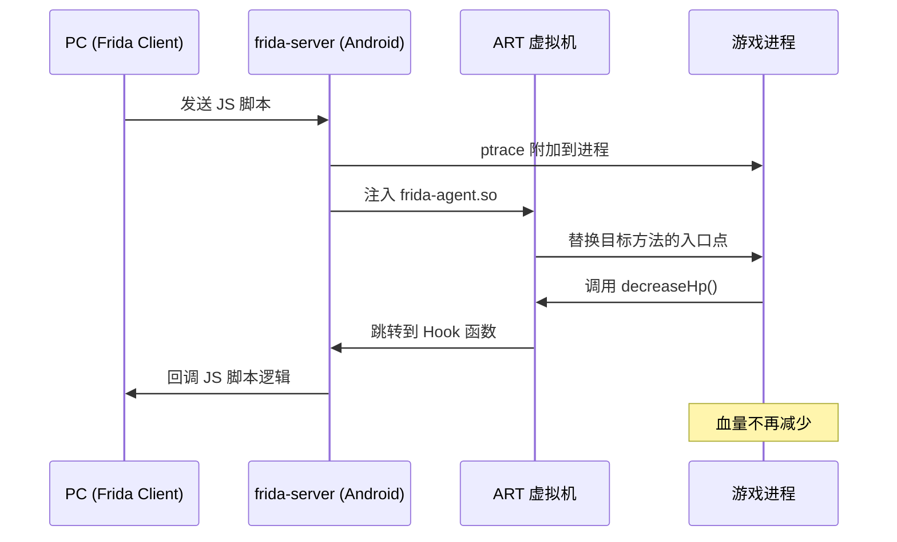

# 动态修改 Android 游戏角色血量 — 技术方案

针对只有 APK 文件的 Android 游戏，在运行时动态修改 `heroAircraft` 血量的完整技术方案。

---

## 方案一：内存搜索与修改（最简单）

### 适用场景

不需要反编译，直接在运行时搜索并修改内存中的血量值。适合纯单机游戏。

### 操作步骤

1. **安装游戏并运行**
   - 将 APK 安装到已 Root 的 Android 设备或模拟器上
   - 启动游戏，观察当前 `heroAircraft` 的血量值

2. **使用内存搜索工具定位血量地址**
   - 工具推荐：**GameGuardian**（Android 端）、**Cheat Engine**（模拟器端）
   - 第一次搜索：输入当前血量值（如 `1000`），搜索类型选择 `DWORD`（4字节整数）
   - 让角色受伤，血量变化后（如变为 `800`），再次搜索新值
   - 反复缩小范围，直到定位到 1~3 个内存地址

3. **修改内存值**
   - 锁定找到的地址，将值修改为目标血量（如 `99999`）
   - 可选择"冻结"该地址，使血量不再减少

4. **验证修改效果**
   - 继续游戏，观察角色是否不再掉血或血量已变更

### 实现原理

```
┌─────────────────────────────────────────────┐
│              Android 进程内存空间              │
├─────────────────────────────────────────────┤
│  Stack    │ 局部变量、方法调用栈               │
│  Heap     │ Java 对象实例 (heroAircraft.hp)  │  ← 目标区域
│  .bss     │ 未初始化的全局变量                 │
│  .data    │ 已初始化的全局变量                 │
│  .text    │ 可执行代码                        │
└─────────────────────────────────────────────┘
```

- Java 对象的字段值存储在 **堆内存（Heap）** 中
- 通过 `/proc/<pid>/mem` 可以读写进程内存
- GameGuardian 等工具通过 `ptrace` 系统调用或 `/proc/pid/mem` 实现内存读写
- 搜索算法：首次全量扫描 → 值变化后差异扫描 → 逐步缩小范围

### 推荐工具

| 工具 | 平台 | 说明 |
|------|------|------|
| **GameGuardian** | Android (Root) | 最强大的 Android 内存修改工具 |
| **Cheat Engine** | PC 模拟器 | 配合 Android 模拟器使用 |
| **VMOS / 虚拟大师** | Android (免Root) | 虚拟机环境，内置 Root |

---

## 方案二：Frida 动态 Hook（最灵活，推荐）

### 适用场景

需要精确控制、自动化修改，或血量值经过加密/混淆。

### 操作步骤

#### 1. 环境准备

```bash
# PC 端安装 Frida
pip install frida-tools

# Android 端部署 frida-server
adb push frida-server /data/local/tmp/
adb shell "chmod 755 /data/local/tmp/frida-server"
adb shell "/data/local/tmp/frida-server &"
```

#### 2. 反编译 APK 分析类结构

```bash
# 使用 jadx 反编译
jadx -d output/ game.apk
```

- 在反编译结果中搜索 `heroAircraft`、`hp`、`health`、`blood` 等关键字
- 定位血量字段名和所在类（如 `com.example.game.HeroAircraft.hp`）

#### 3. 编写 Frida Hook 脚本

```javascript
// hook_hp.js
Java.perform(function() {
    // 假设通过反编译找到了 HeroAircraft 类
    var HeroAircraft = Java.use("com.example.aircraft.HeroAircraft");

    // 方式一：Hook 血量减少方法，阻止扣血
    HeroAircraft.decreaseHp.implementation = function(decrease) {
        console.log("[*] decreaseHp called, original decrease: " + decrease);
        // 不执行扣血，直接返回
        return;
    };

    // 方式二：Hook getHp 方法，始终返回最大值
    HeroAircraft.getHp.implementation = function() {
        console.log("[*] getHp called, returning max HP");
        return 99999;
    };

    // 方式三：直接修改字段值
    Java.choose("com.example.aircraft.HeroAircraft", {
        onMatch: function(instance) {
            console.log("[*] Found HeroAircraft instance");
            instance.hp.value = 99999;
            console.log("[*] HP set to: " + instance.hp.value);
        },
        onComplete: function() {
            console.log("[*] Search complete");
        }
    });
});
```

#### 4. 注入并运行

```bash
# 附加到运行中的游戏进程
frida -U -l hook_hp.js -f com.example.game

# 或附加到已运行的进程
frida -U -l hook_hp.js "GameName"
```

### 实现原理



- **ART Hook**：Frida 修改 ART 虚拟机中方法的 `entry_point_from_quick_compiled_code`，将其指向 Frida 的 trampoline 代码
- **Inline Hook**：对于 Native 方法，直接修改函数开头的机器指令，跳转到 Hook 函数
- `Java.use()` 通过 ClassLoader 反射获取类引用
- `Java.choose()` 遍历 GC 堆中的对象实例

---

## 方案三：Xposed 框架模块（持久化修改）

### 适用场景

需要每次启动游戏都自动生效，长期使用。

### 操作步骤

#### 1. 安装 Xposed 框架

- Android 5-8：使用原版 Xposed
- Android 8+：使用 **LSPosed**（基于 Magisk）
- 安装步骤：Magisk → 安装 LSPosed 模块 → 重启

#### 2. 开发 Xposed 模块

```java
public class HpHook implements IXposedHookLoadPackage {
    @Override
    public void handleLoadPackage(XC_LoadPackage.LoadPackageParam lpparam) {
        if (!lpparam.packageName.equals("com.example.game")) return;

        // 方式一：Hook 扣血方法，将扣血量改为0
        XposedHelpers.findAndHookMethod(
            "com.example.aircraft.HeroAircraft",
            lpparam.classLoader,
            "decreaseHp",
            int.class,
            new XC_MethodHook() {
                @Override
                protected void beforeHookedMethod(MethodHookParam param) {
                    param.args[0] = 0;
                }
            }
        );

        // 方式二：Hook 获取血量方法，始终返回最大值
        XposedHelpers.findAndHookMethod(
            "com.example.aircraft.HeroAircraft",
            lpparam.classLoader,
            "getHp",
            new XC_MethodHook() {
                @Override
                protected void afterHookedMethod(MethodHookParam param) {
                    param.setResult(99999);
                }
            }
        );
    }
}
```

#### 3. 激活模块

在 LSPosed 管理器中激活模块，勾选目标游戏，重启生效。

### 实现原理

- Xposed 替换了 Android 的 `app_process`（Zygote 进程）
- 所有 App 进程都从 Zygote fork 而来，因此 Xposed 可以在任何 App 启动前注入代码
- LSPosed 基于 **Riru/Zygisk**（Magisk 模块），通过 `LD_PRELOAD` 或 PLT Hook 注入到 Zygote
- 方法替换：将 Java 方法标记为 Native，然后将其实现指向 Xposed 的 Bridge 方法

---

## 方案四：APK 静态修改（重打包）

### 适用场景

一劳永逸地修改，不需要 Root。

### 操作步骤

#### 1. 反编译 APK

```bash
apktool d game.apk -o game_decompiled
```

#### 2. 定位并修改 Smali 代码

在 `smali` 目录中搜索血量相关代码：

```bash
grep -r "decreaseHp\|getHp\|health\|hp" game_decompiled/smali/
```

修改 Smali 代码，例如将扣血方法改为空实现：

```smali
.method public decreaseHp(I)V
    .locals 0
    # 直接返回，不执行扣血
    return-void
.end method
```

#### 3. 重新打包并签名

```bash
# 重新打包
apktool b game_decompiled -o game_modified.apk

# 生成签名密钥
keytool -genkey -v -keystore my.keystore -alias mykey \
    -keyalg RSA -keysize 2048 -validity 10000

# 签名 APK
jarsigner -verbose -sigalg SHA1withRSA -digestalg SHA1 \
    -keystore my.keystore game_modified.apk mykey

# 或使用 apksigner
apksigner sign --ks my.keystore game_modified.apk
```

#### 4. 安装修改后的 APK

```bash
adb install game_modified.apk
```

### 实现原理

- APK 中的 `classes.dex` 包含 Dalvik 字节码
- `apktool` 将 DEX 反编译为 **Smali**（Dalvik 汇编语言）
- 修改 Smali 代码等同于修改字节码逻辑
- 重打包后生成新的 DEX 文件，实现代码级别的永久修改

---

## 附录：Android 版本兼容性与保护机制应对

### 版本兼容性

| Android 版本 | 注意事项 |
|-------------|---------|
| 5.0 - 7.1 | ART 运行时，Xposed 原版支持良好 |
| 8.0 - 9.0 | SELinux 更严格，需要 Magisk 绕过 |
| 10 - 12 | Scoped Storage 限制，推荐 LSPosed + Zygisk |
| 13 - 15 | 需要最新版 Magisk (26+) 和 LSPosed |

### 常见保护机制与绕过

| 保护机制 | 说明 | 绕过方案 |
|---------|------|---------|
| **Root 检测** | 检测 su 二进制、Magisk 等 | Magisk Hide / Shamiko 模块 |
| **完整性校验** | 校验 APK 签名或 DEX 哈希 | Hook 校验函数返回正确值 |
| **代码混淆** | ProGuard/R8 混淆类名方法名 | jadx 反混淆 + 特征分析 |
| **内存保护** | 定时校验关键内存值 | Hook 校验线程或冻结内存值 |
| **反调试** | 检测 ptrace/Frida 特征 | Frida Gadget 模式 / 反检测脚本 |
| **加固** | 360加固、腾讯乐固等 | FDex2 脱壳 / Frida dump dex |

### 推荐工具汇总

| 类别 | 工具 | 用途 |
|------|------|------|
| **反编译** | jadx、apktool、JEB | 分析 APK 结构和代码 |
| **内存修改** | GameGuardian、Cheat Engine | 运行时搜索修改内存值 |
| **动态 Hook** | Frida、Objection | 运行时 Hook Java/Native 方法 |
| **持久 Hook** | LSPosed (Xposed)、Magisk | 持久化的方法拦截 |
| **Root** | Magisk、KernelSU | 获取设备 Root 权限 |
| **模拟器** | 雷电模拟器、MuMu | 免实机测试，自带 Root |
| **脱壳** | FDex2、BlackDex、Frida | 应对加固 APK |
| **抓包** | Charles、mitmproxy | 分析网络通信（如服务端校验） |

---

## 推荐优先级

| 优先级 | 方案 | 理由 |
|-------|------|------|
| 🥇 | **Frida 动态 Hook** | 最灵活、可精确控制、支持自动化 |
| 🥈 | **GameGuardian 内存修改** | 最简单、无需反编译 |
| 🥉 | **APK 重打包** | 一劳永逸、不需要 Root |
| 4 | **Xposed 模块** | 适合长期使用、每次启动自动生效 |

> **注意**：如果游戏有服务端血量校验（即血量由服务器维护），则客户端修改可能无效，需要配合抓包分析网络协议。对于纯单机游戏（如本项目的飞机大战），客户端内存修改即可完全生效。
